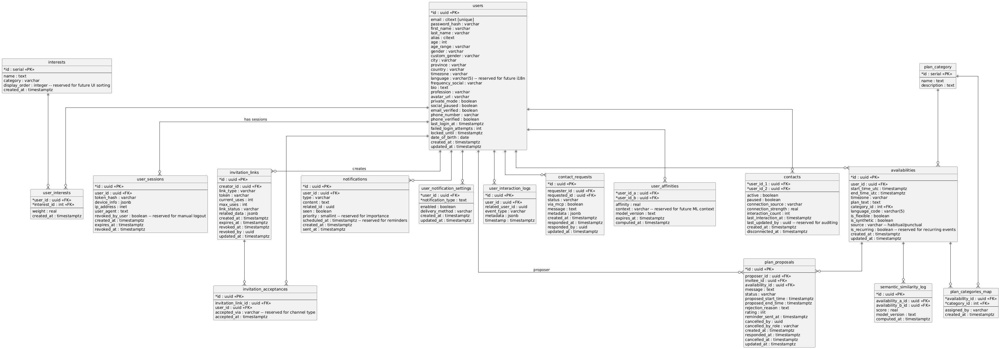

# Yokedo

Yokedo es una web app para coordinar quedadas entre amigos sin líos de mensajes.  
Permite compartir disponibilidad, generar enlaces de invitación y proponer planes en un par de clics.

## Estructura del repositorio

- `backend/auth-service/`: servicio de autenticación (FastAPI).  
- `.github/workflows/`: configuración de CI/CD.  
- `docker-compose.yml`: PostgreSQL + servicios en local.  
- `README.md`: este documento.

## Primeros pasos

1. Clonar el repo  
2. `docker-compose up --build`  
3. Explorar el servicio de auth en `http://localhost:8001`

